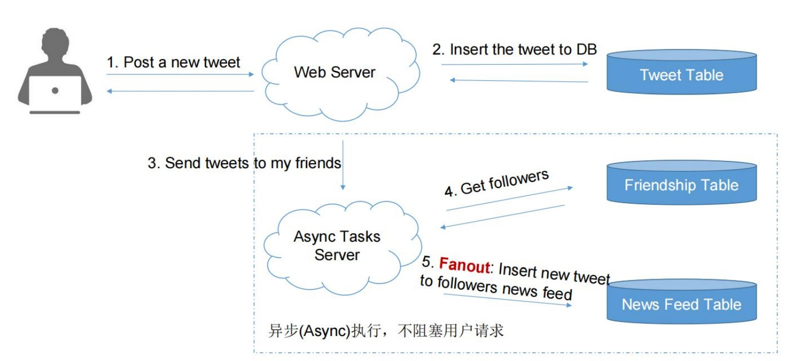
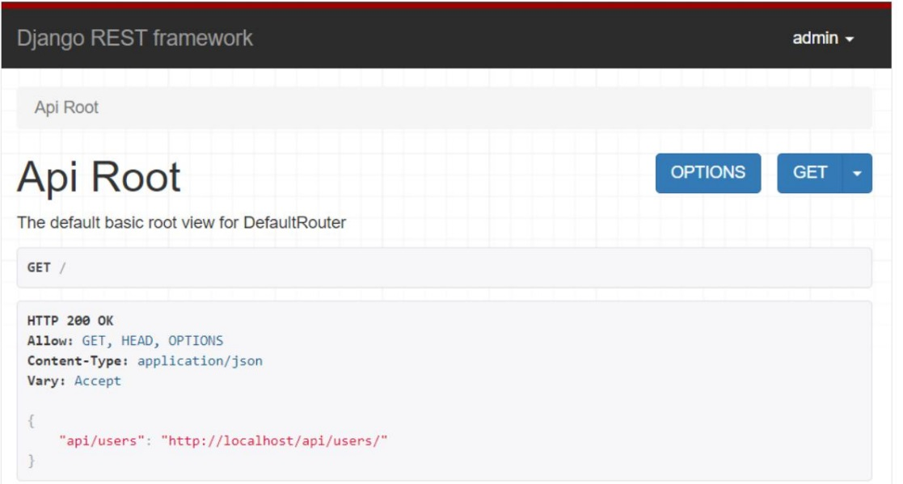
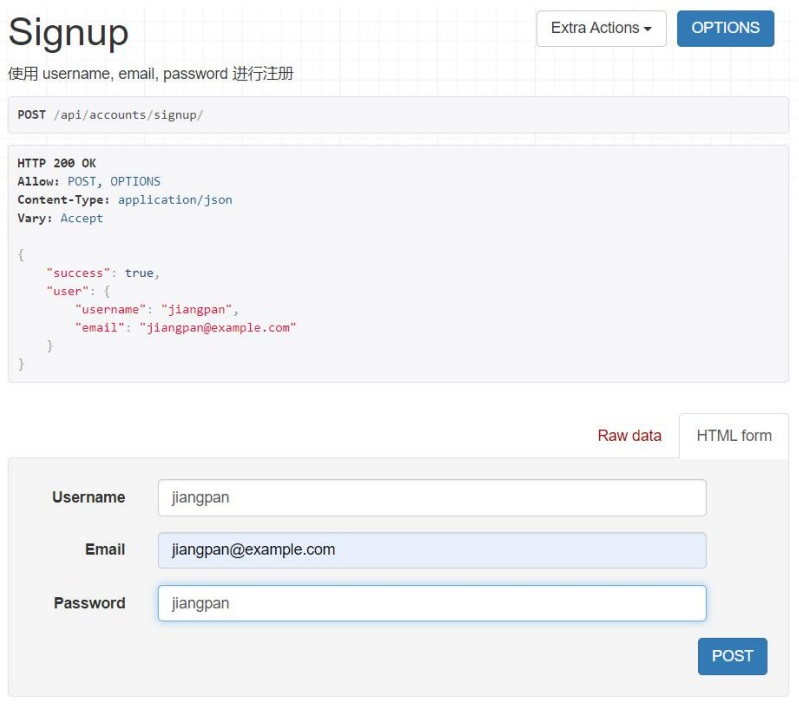

# Twitter 后端系统 - Python 项目实战

|:books: |:bulb: |:house: |:rocket: |:checkered_flag:|:email:|
| :--------: | :---------: | :------: | :------: | :------: | :------: |
| [介绍](#介绍) | [技术栈](#技术栈) | [信息流系统](#信息流系统) | [演示](#演示) | [后续内容](#后续内容) | [联系作者](#联系作者) |

## 介绍
**Twitter 后端系统**：从零设计一个高并发的信息流系统，完整搭建对标P8（L5）水准的项目，可用于毕设、简历等

**涉及到的重点知识包括：**
-  Pull & Push 模型分析对比
- 高性能系统必备消息队列 Message Queue 应用场景
- Denormalization 去标准化（冗余存储技术）

**涉及的面试难点包括：**
- 如何分别测试登录用户和未登录用户？
- 如何做反向查询？
- 如何设计数据库表达？
- 如何让部分用户看到某个新功能，其他用户看到的就是功能？（灰度测试）
- comments的API该如何设计？

**建议访问课程以获取更多项目源码：**
[https://www.jiuzhang.com/course/89/](https://www.jiuzhang.com/course/89/?utm_source=sc-github-zyq "https://www.jiuzhang.com/course/89/")
 
## 技术栈
| 技术                             | 官网                                                                                       |
|----------------------------------|--------------------------------------------------------------------------------------------|
|Django                            |[https://www.djangoproject.com/](https://www.djangoproject.com/)                            |
|Django REST framework             |[https://www.django-rest-framework.org/](https://www.django-rest-framework.org/)            |
|MySQL                             |[https://www.mysql.com/](https://www.mysql.com/)                                            |
|HBase                             |[https://hbase.apache.org/](https://hbase.apache.org/)                                      |
|Redis                             |[https://redis.io/](https://redis.io/)                                                      |
|Memcached                         |[http://memcached.org/](http://memcached.org/)                                              |
|RabbitMQ                          |[https://www.rabbitmq.com/](https://www.rabbitmq.com/)                                      |

## 信息流系统
在设计信息流系统时，一般有两种信息流模式：`拉(pull)模式` 和 `推(push)模式`，如果去设计一个如 Tweet 的社交网络服务系统：

`拉(pull)模式`：在 `拉(pull)模式`，下一个人发帖只在 Tweet 表单中产生一条新记录。

`推(push)模式`：在 `推(push)模式`，下一个人发帖除了在 Tweet 表单中产生一条新纪录，还会产生 N 条 NewsFeed 记录，N 是粉丝的个数。

本项目选择使用 `推(push)模式`，流程图如下：

## 演示

本项目为 Django 前后端分离项目，以后端 API 开发为主，界面基于 Django REST framework，相关演示图如下：

 

## 后续内容

* 推文模块 Tweet 
* 好友关系模块 Friendship
* 信息交互模块 NewsFeed
  * 代码结构中引入 Service 处理 views 和 models 之间的复杂逻辑
* 评论模块 Comment
  * 用 decorators 实现丢失参数检测的，优化代码逻辑
  * 在 Tweet 中带上所有的评论信息
* 点赞模块 Like
  * 设计一个通用的点赞类，可以同时记录对 Tweet 的点赞和对 Comment 的点赞
  * 使用 Serializer 的继承关系避免重复代码
* 用 django-notification 增加评论点赞关注的消息提醒
  * 基于第三方开源项目自定制 API
  * 使用 Service 类包装复杂逻辑
* 图像上传
  * 增加 UserProfile Model 实现头像，昵称等信息的存储
  * django 的 listener 机制
  * OneToOneField
  * Tweet 图像上传
* 翻页 Pagination 与缓存 Cache
  * 实现 user timeline 和 newsfeed 的翻页 Pagination
  * 通过缓存优化好友关系与用户信息
* 使用 Redis 缓存用户推文
  * 获取某个用户的 tweets
  * QuerySet 惰性加载
  * Redis RPUSH 操作
  * 增加 Cache 来加速 NewsFeed 的访问效率
* 增加 Message Queue 来实现 fanout
  * Django 接入消息队列的第三方库：Celery
* 增加限流器 Rate Limiter 用于限制恶意访问和减少不必要的数据库操作
  * 安装 Django RateLimiter 来进行访问频次限制
* ......

## 联系作者

添加个人微信号发送关键词【Github】获取更多源码

